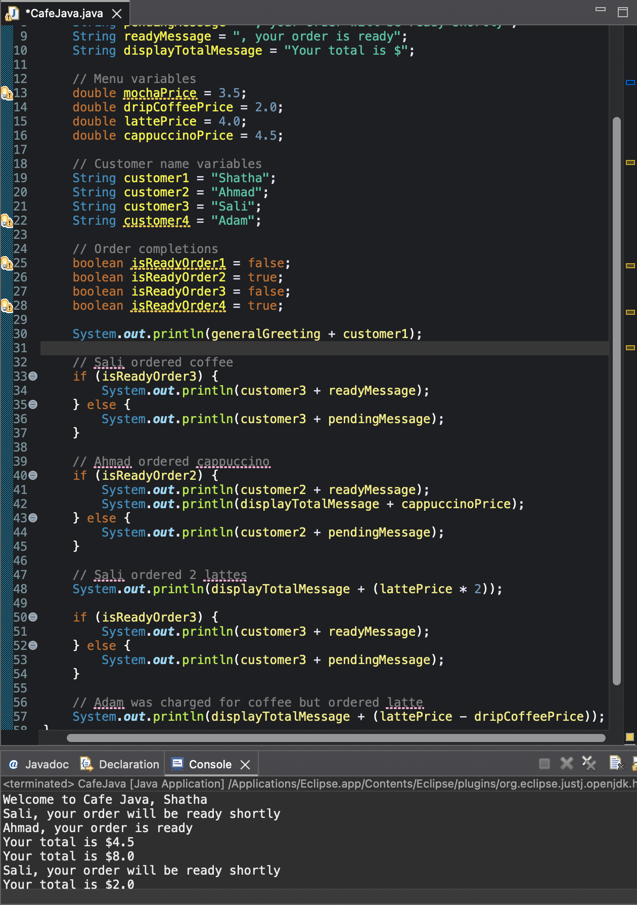

## Screenshot



# Cafe Java

## Description

Cafe Java is a Java Fundamentals assignment that simulates the ordering logic of a coffee shop. The program uses variables, conditionals, and basic calculations to manage customer orders and display order statuses.

## Features

- Store menu item prices
- Track customer orders
- Check order readiness using boolean variables
- Display order status messages
- Calculate and display order totals
- Calculate price differences for incorrect charges

## Technologies Used

- Java

## How to Run

Compile the program:

```bash
javac CafeJava.java
```

Run the program:

```bash
java CafeJava
```

## Sample Output

```text
Welcome to Cafe Java, Shatha
Sali, your order will be ready shortly
Ahmad, your order is ready
Your total is $4.5
Your total is $8.0
Sali, your order will be ready shortly
Your total is $2.0
```

## Author

Murad Shaheen
