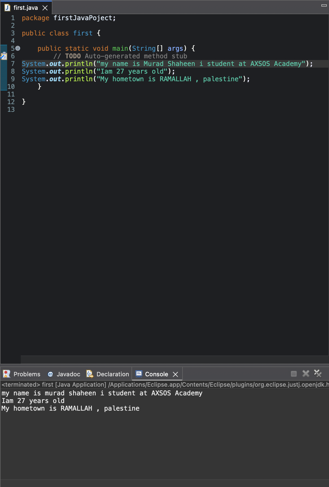

Screenshot Summary
The image shows:
Assignment title: First Java Program
Create a new Java source file.
Print your name, age, and hometown on separate lines.
Compile the program successfully.
Run the .class file to see the output.
Upload one file as the submission.
This is basically your first Java "Hello World" style assignment using System.out.println().
# First Java Program

## Output Screenshot

