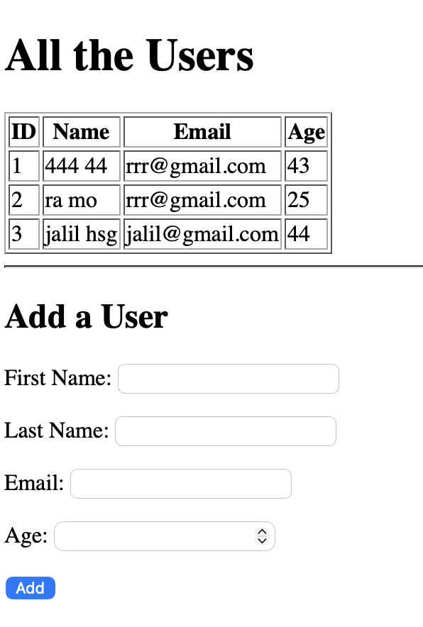

# Users with Templates

This Django assignment displays all users from the database in a table and allows adding a new user using a form.

## Features

- Show all users
- Add new user
- Save data to database
- Redirect back to homepage after submit

## Run

python manage.py runserver
