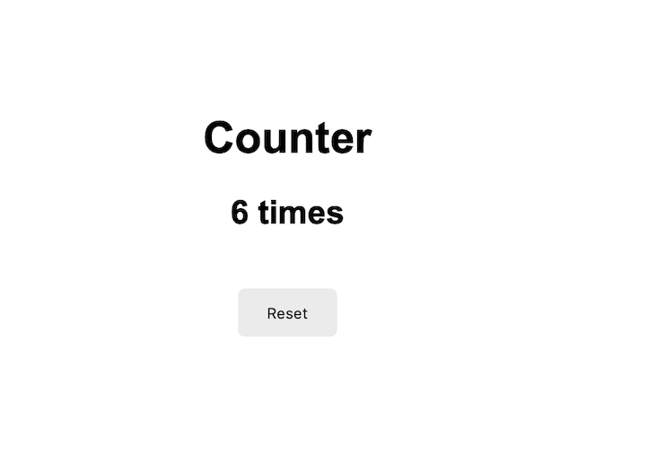

## screenshots for page

---

# Counter App

Simple Django app that counts how many times the user visits the page using sessions.

Features:

- Count page visits
- Store data in session
- Reset the counter
- +2 button bonus

What I practiced:

- Django sessions
- Routes
- Views
- Templates
- Redirects
