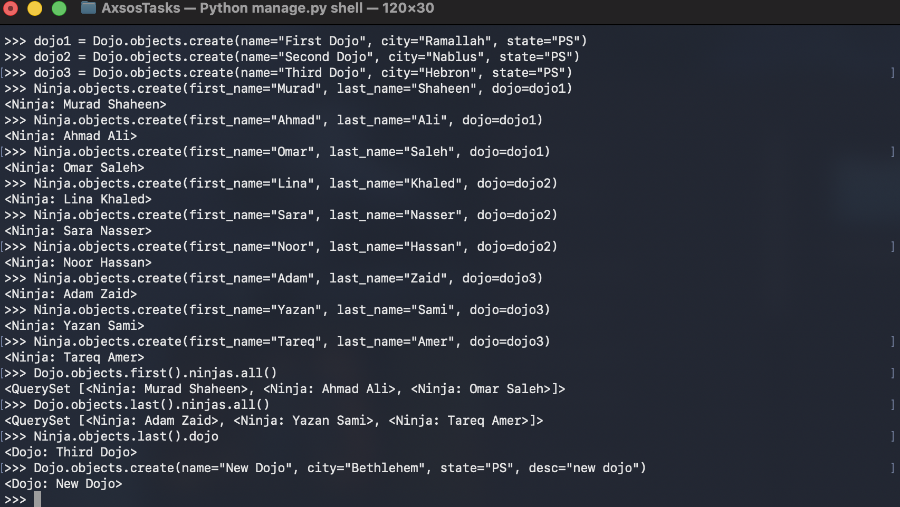

# Dojo & Ninjas Shell Assignment

This assignment is about using Django ORM inside the Django shell.

## What I practiced

- Creating Django models
- Making one-to-many relationships
- Running migrations
- Using Django shell
- Creating, deleting, and retrieving data from the database

---

## Commands Used

```bash
python manage.py startapp dojo_ninjas_app
python manage.py makemigrations
python manage.py migrate
python manage.py shell
```

---

## Screenshot



---

## What I learned

I learned how Django models are connected to database tables, and how ForeignKey creates a relationship between two models. I also practiced using the Django shell to create, delete, and retrieve data without using views or templates.
