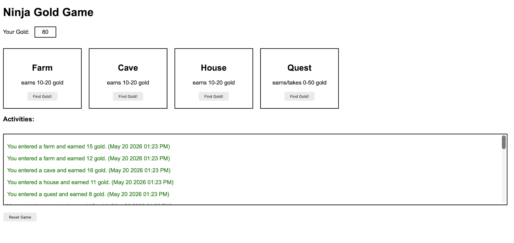

## screenshots for page

---

# Ninja Gold

This is a simple Django game where the player earns or loses gold by choosing different places.

The project uses Django sessions to save the current gold amount and the activity history.

Places:

- Farm: earns 10-20 gold
- Cave: earns 10-20 gold
- House: earns 10-20 gold
- Quest: earns or loses 0-50 gold

I practiced:

- Django routes
- Views
- Templates
- Forms with POST
- Hidden inputs
- Sessions
- Redirects
