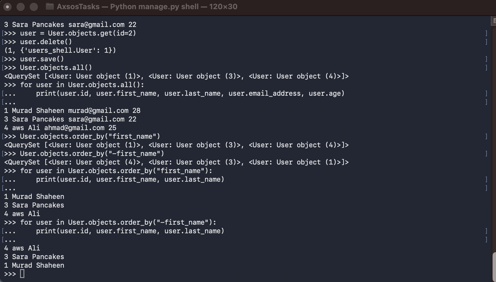

Users Shell ORM
Simple Django ORM practice using Django Shell.
What I did
Created Django app called users_shell
Created User model
Ran migrations
Opened Django shell
Added users to database
Retrieved users
Updated a user last name
Deleted a user
Sorted users by first name
Technologies
Python
Django
ORM
SQLite
