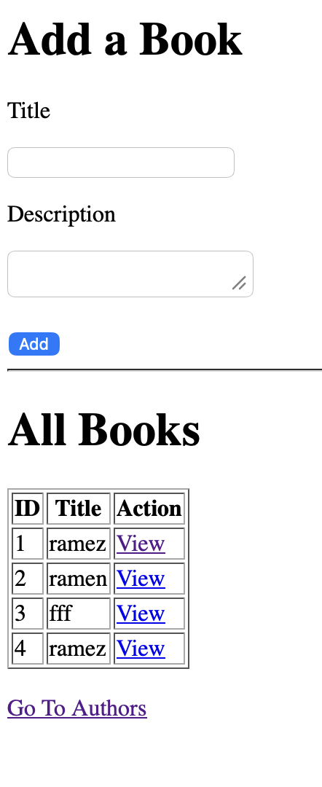
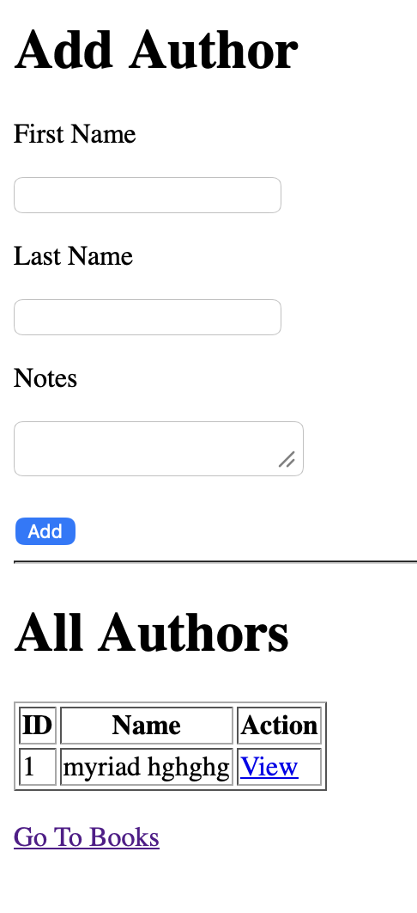
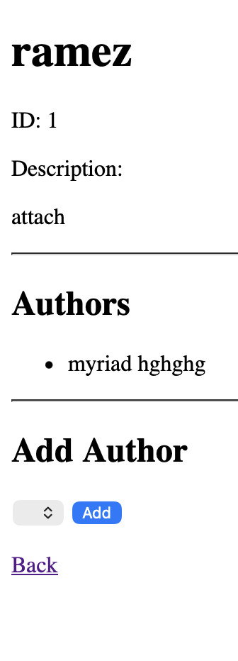

# Books & Authors with Templates

## Project Overview

This project demonstrates a **Many-to-Many Relationship** between Books and Authors using Django.

Users can create books and authors, view their details, and associate books with authors through forms and templates.

---

## Features

### Books

- Add new books
- Display all books in a table
- View detailed information about a specific book
- View all authors associated with a book
- Add authors to a book

### Authors

- Add new authors
- Display all authors in a table
- View detailed information about a specific author
- View all books associated with an author
- Add books to an author

### Bonus Feature

- Dropdown menus only display authors or books that are not already associated with the selected book or author.

---

## Technologies Used

- Python
- Django
- HTML
- SQLite3

---

## Project Screenshots

### Books Page

---

### Book Details Page

---

### Authors Page

---

## Learning Objectives

- Django Models
- Django ORM
- Many-to-Many Relationships
- URL Routing
- Templates
- Forms
- POST Requests
- Database Queries
- Related Objects

---

## Author

**Murad Shaheen**

AXSOS Academy – Full Stack Development Bootcamp
