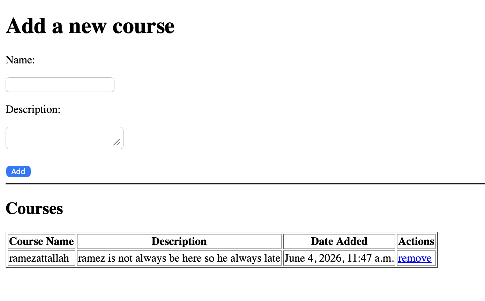
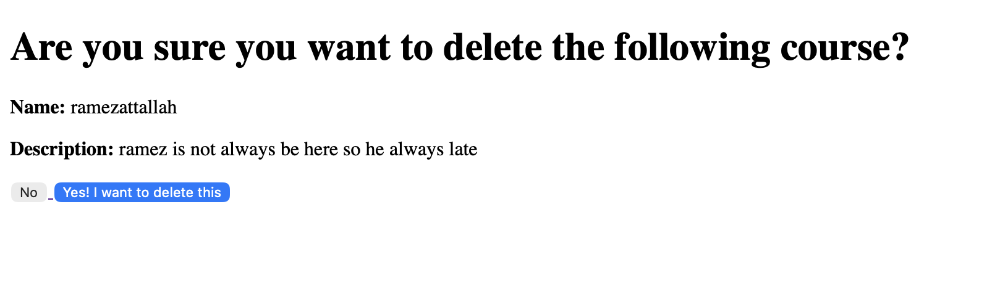

# 📚 Courses Assignment - Django

A simple Django project for adding, displaying, validating, and deleting courses from a database.

---

## 🚀 Features

- Add a new course
- Validate course name and description
- Display all courses in a table
- Show delete confirmation page
- Delete course using POST request
- Redirect back to home after deleting or canceling

---

## ✅ Validations

- Course name must be more than 5 characters
- Description must be more than 15 characters
- If validation fails, errors are displayed on the home page

---

## 🧠 Project Structure

```text
Courses/
├── manage.py
├── README.md
├── Courses/
│   ├── settings.py
│   ├── urls.py
│   └── ...
└── courses_app/
    ├── models.py
    ├── views.py
    ├── urls.py
    └── templates/
        └── courses_app/
            ├── index.html
            └── delete.html
```




