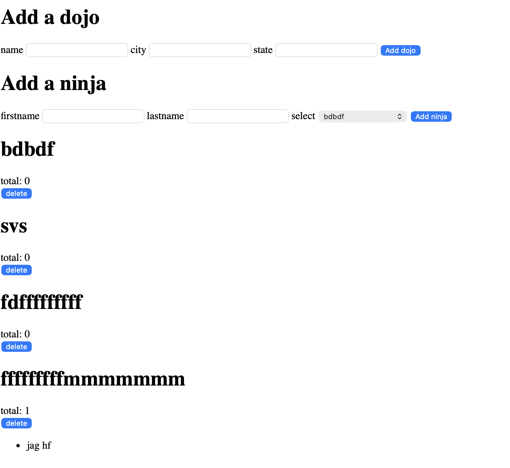

# Dojos and Ninjas

## Description

A Django application that allows users to create Dojos and Ninjas and assign each Ninja to a specific Dojo.

## Features

- Add a new Dojo
- Add a new Ninja
- Assign Ninjas to Dojos
- Display all Dojos
- Display the number of Ninjas in each Dojo
- Display all Ninjas belonging to each Dojo
- Delete a Dojo and all associated Ninjas

## Technologies Used

- Python
- Django
- SQLite3
- HTML
- CSS

## Screenshot

## Author

Murad Shaheen
