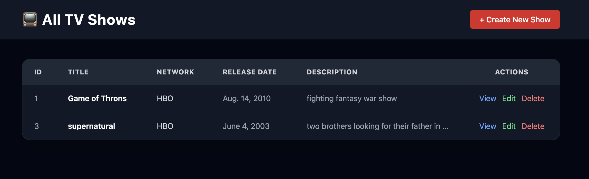
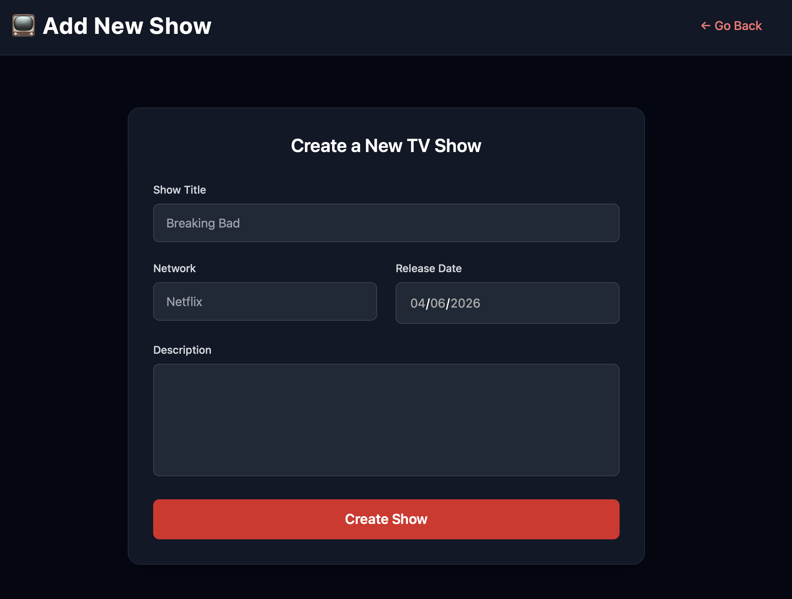

# 📺 TV Shows Validated (Django)

A Django web application for managing TV shows with full CRUD functionality and server-side validation.
Users can create, view, update, and delete TV shows while ensuring that all submitted data is validated before being saved to the database.

---

## 🚀 Features

### 📺 TV Shows Module

- ➕ Create new TV shows
- 📄 View all TV shows
- 👁 View detailed information for each show
- ✏️ Edit existing TV shows
- 🗑 Delete TV shows securely using POST requests

### ✅ Validation Features

- Title must be at least 2 characters
- Network must be at least 3 characters
- Release Date is required
- Release Date must be in the past
- Description is optional
- If Description is provided, it must be at least 10 characters
- TV Show title must be unique

### 🎨 UI / UX

- Modern dark-themed interface
- Responsive design using TailwindCSS
- Validation error messages displayed directly on forms

---

## 🧠 Project Structure

```text
tv_show/
├── models.py
├── views.py
├── urls.py
├── templates/
│   └── tv_show/
│       ├── all_shows.html
│       ├── create_new_show.html
│       ├── edit_show.html
│       └── show_tv_information.html
```

---

## 🗄️ Database Model

### TVShow

| Field        | Type          |
| ------------ | ------------- |
| title        | CharField     |
| network      | CharField     |
| release_date | DateField     |
| description  | TextField     |
| created_at   | DateTimeField |
| updated_at   | DateTimeField |

---

## ⚙️ Installation

### Create Virtual Environment

```bash
python -m venv env
```

### Activate Environment

```bash
source env/bin/activate
```

### Install Django

```bash
pip install django
```

### Run Migrations

```bash
python manage.py makemigrations
python manage.py migrate
```

### Start Server

```bash
python manage.py runserver
```

Open:

```text
http://127.0.0.1:8000/
```

---

## 🌐 Routes

| Route                | Method | Description          |
| -------------------- | ------ | -------------------- |
| /                    | GET    | Display all TV shows |
| /shows/new/          | GET    | Display create form  |
| /shows/create/       | POST   | Create TV show       |
| /shows/<id>/         | GET    | Display one TV show  |
| /shows/<id>/edit/    | GET    | Display edit form    |
| /shows/<id>/update/  | POST   | Update TV show       |
| /shows/<id>/destroy/ | POST   | Delete TV show       |

---

## ⚙️ Validation Rules

- Title ≥ 2 characters
- Network ≥ 3 characters
- Release Date is required
- Release Date must be before today
- Description is optional
- Description ≥ 10 characters if provided
- Title must be unique

---

## 🛠️ Technologies Used

- Python 3
- Django
- SQLite3
- HTML5
- TailwindCSS

---

## 📷 Screenshots

### All Shows



### Add New Show



---

## 👨‍💻 Author

Murad Shaheen

Built as part of the AXSOS Full Stack Development Program to practice:

- Django CRUD Operations
- Model Validations
- URL Routing
- Template Rendering
- Form Handling
- TailwindCSS UI Development
