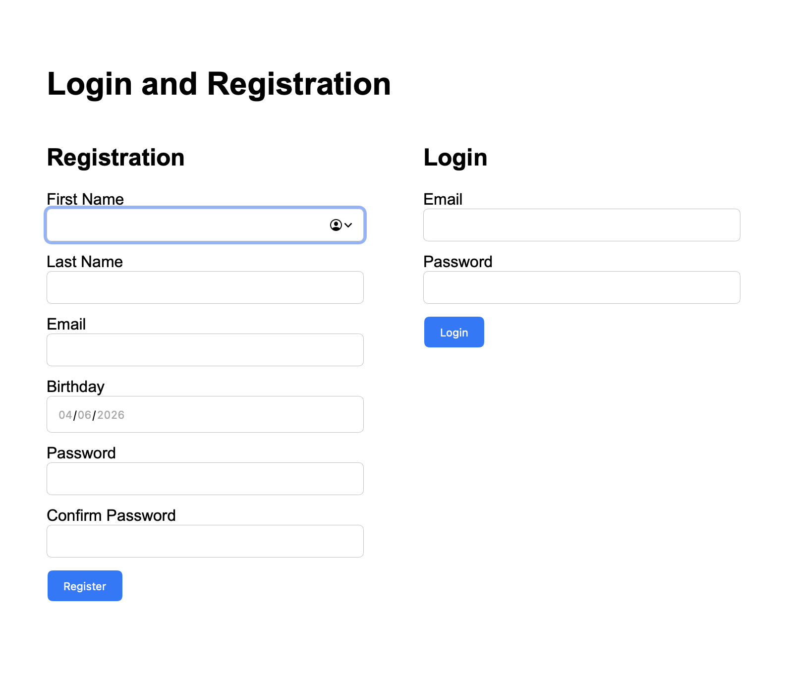
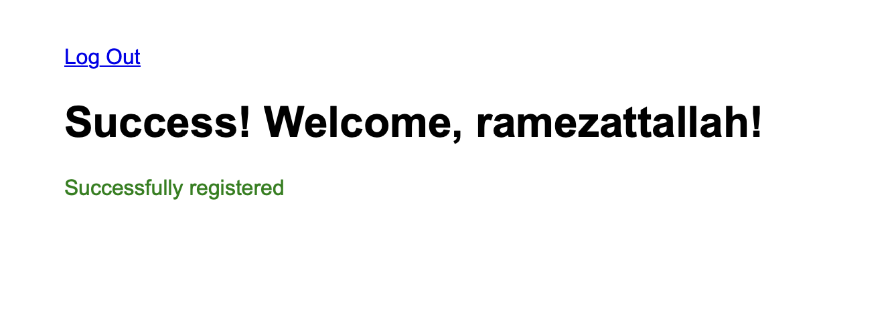

# Login and Registration Assignment

This is a Django project for login and registration with validations, flash messages, sessions, and password encryption.

## Features

- Register new users
- Login existing users
- Validate first name and last name
- Validate email format
- Validate unique email
- Validate password length
- Confirm password match
- Birthday validation
- User must be at least 13 years old
- Password encryption using bcrypt
- Flash messages
- Session login
- Logout
- Protected success page

## Technologies Used

- Python
- Django
- SQLite
- HTML
- CSS
- bcrypt

## How to Run

```bash
pip install bcrypt
python manage.py makemigrations
python manage.py migrate
python manage.py runserver
```



