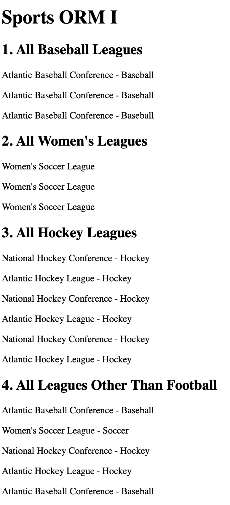
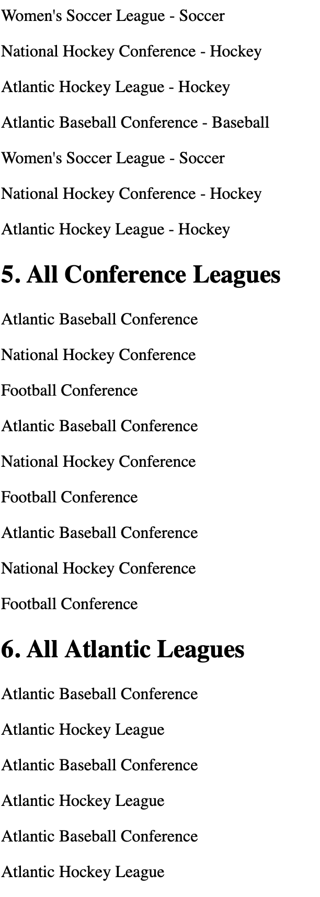
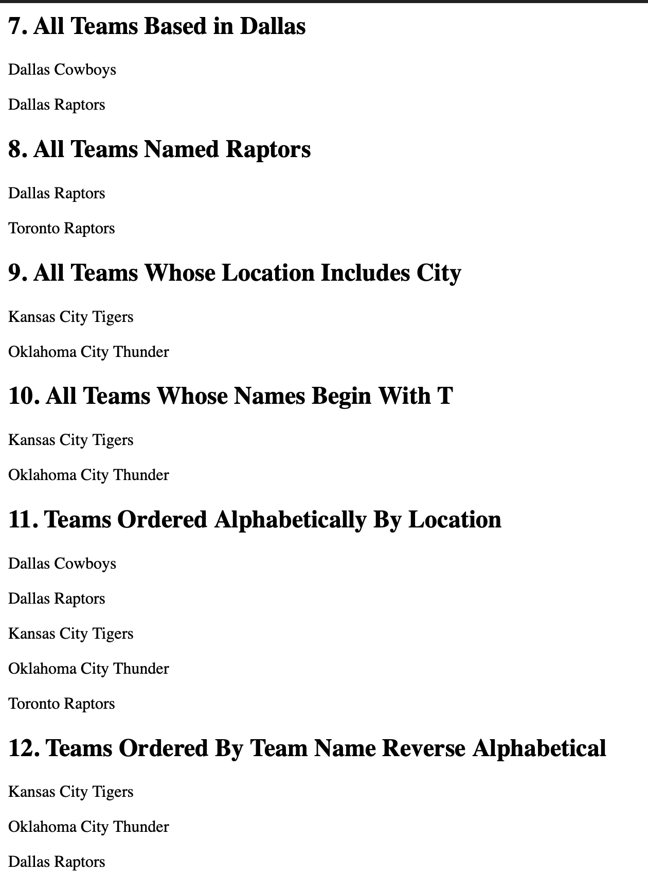
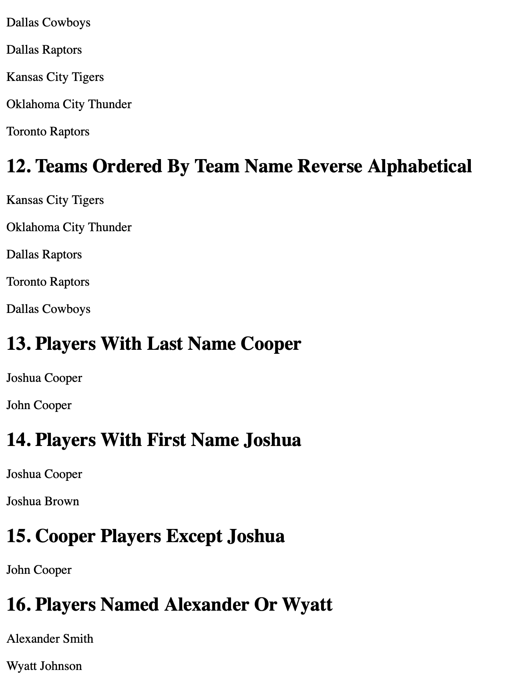

# Sports ORM I

This project is a Django ORM assignment for practicing advanced database queries using a pre-existing sports database.

## Assignment Objective

The goal of this assignment is to use Django ORM queries to retrieve leagues, teams, and players from the database and display the results on the main page.

## Features

* Display all baseball leagues
* Display all women's leagues
* Display all hockey leagues
* Display leagues excluding football
* Display conference and Atlantic leagues
* Display teams based on location and name
* Display players by first name and last name
* Use `filter()`, `exclude()`, `contains`, `startswith`, and `order_by()`

## Technologies Used

* Python
* Django
* SQLite
* HTML
* Django ORM

## Screenshots

### 1. Project Running

### 2. ORM Queries Page

### 3. Query Results

### 4. Final Output

## What I Learned

In this assignment, I learned how to use Django ORM to query data from the database and display the results in an HTML template.
I practiced filtering, excluding, ordering, and searching data using different ORM methods.
