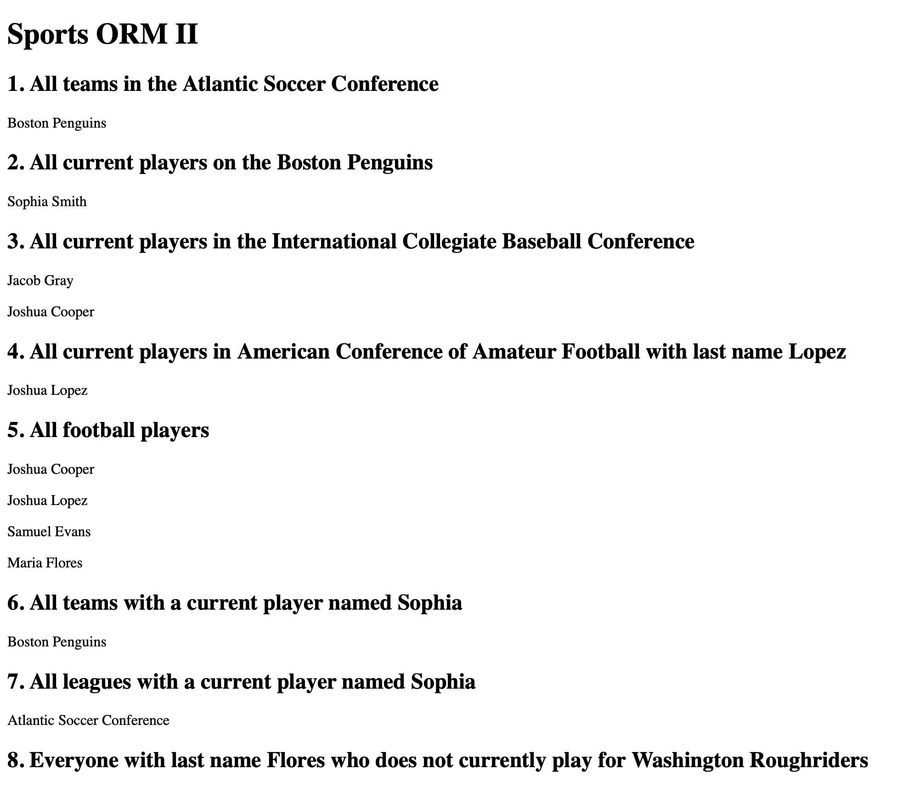
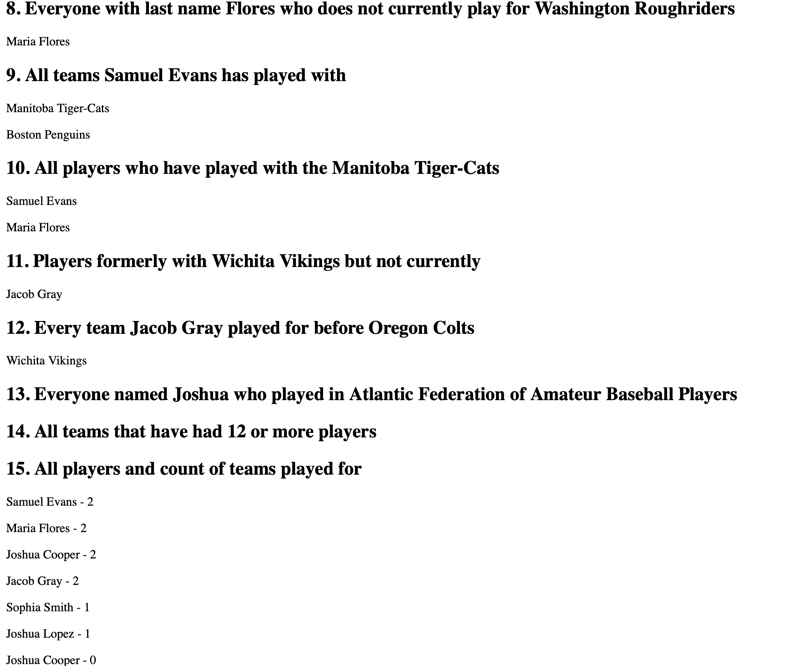

# Sports ORM II

## Overview

This project is a Django ORM assignment focused on querying related data between leagues, teams, and players using ForeignKey and ManyToMany relationships.

## Technologies

- Python
- Django
- SQLite
- Django ORM

## Screenshots

### Home Page

### Query Results

## What I Learned

- Using `filter()` and `exclude()`
- Querying through relationships
- ForeignKey and ManyToMany fields
- Using `annotate()` and `Count()`
- Displaying ORM query results in templates
